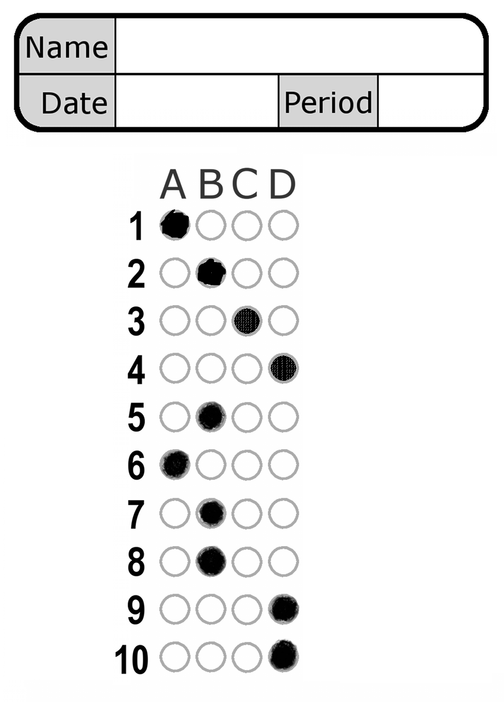
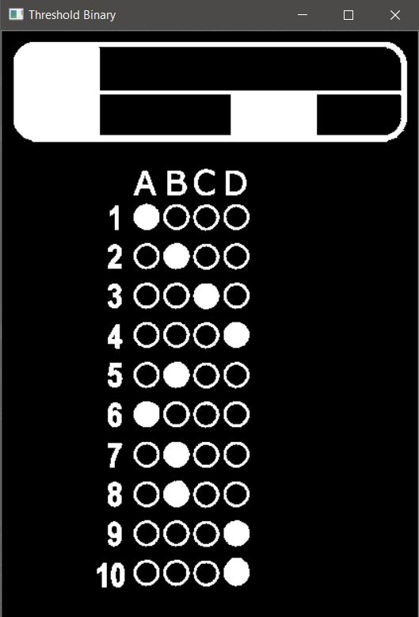
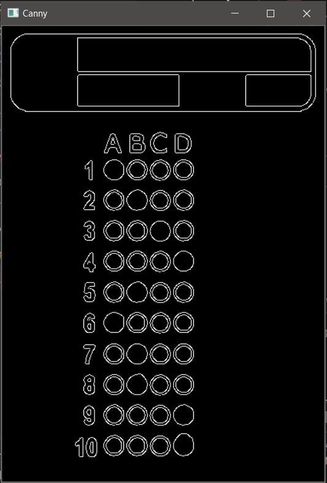
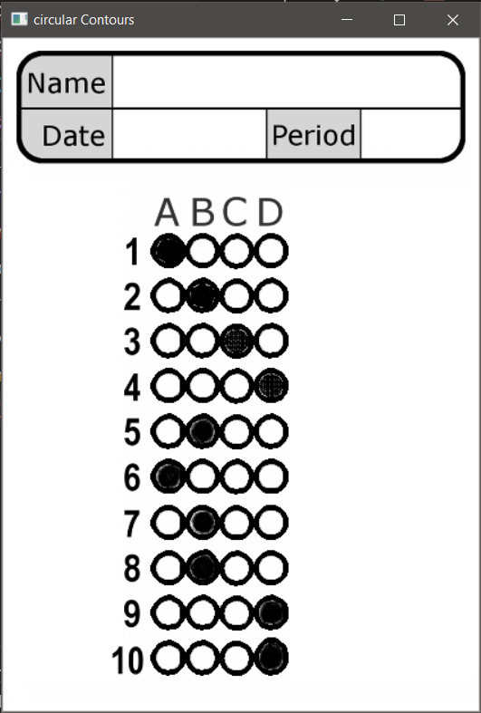
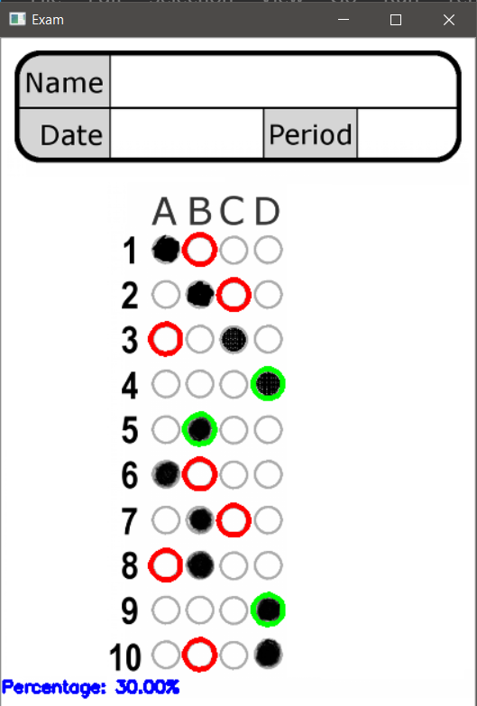
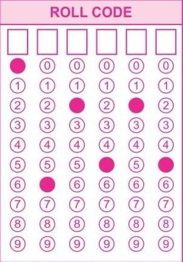

# OMR Sheet
Detect contours using OpenCV to evaluate OMR Sheet

## Working of OMRSheet.ipynb

###### 1. Convert Image to grayscale
###### 2. Remove Noise Using Gaussian Blur
###### 3. Apply Thresholding and find out edges
###### 4. Find out the OMR Sheet(Contour) in the image
###### 5. Crop out the OMR Sheet part of image
###### 6. Apply Thresholding and canny edge method on the cropped image

###### 7. Now find out all the circular(specifically choosen shape of bubbles) contours

###### 8. Sort them row wise top to bottom
###### 9. Generate mask using Thresholded image
###### 10. AND this mask with the Thresholded image and count non zero pixels
###### 11. More Non Zero pixels means this Option is bubbled, so store it
###### 12. Compare Bubbled answer with actual answer
###### 13. Draw Contours on Correct options with red and green color(acc to filled bubble)

## ---------------------------------------------------------------------------
## Working of OMRSheetRollNo.ipynb

###### Wroking will be same with few changes
###### 1. This time we need to consider exactly 1 bubbled contour in each column(not in row)
###### 2. To filter Circular contours more accuratly, shape matching is applied on each filtered contour to remove any noisy contour(if any)

